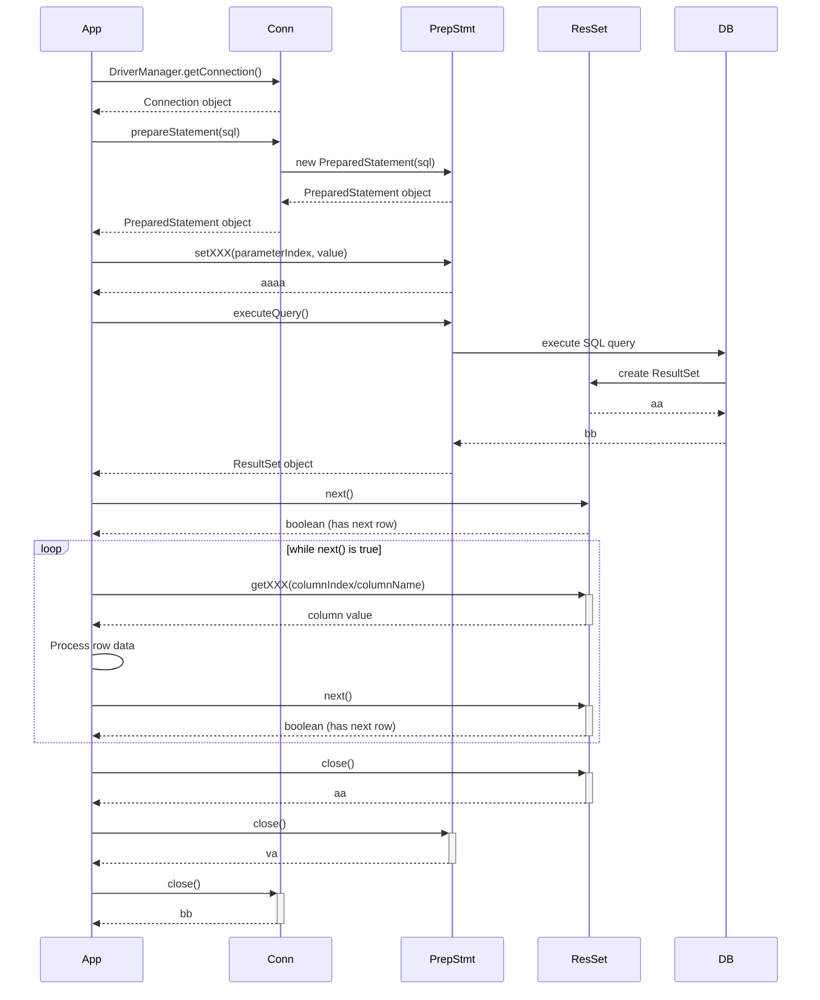

```mermaid
sequenceDiagram
    participant App
    participant Conn
    participant PrepStmt
    participant ResSet
    participant DB
    App ->> Conn: DriverManager.getConnection()
    Conn -->> App: Connection object
    App ->> Conn: prepareStatement(sql)
    Conn ->> PrepStmt: new PreparedStatement(sql)
    PrepStmt -->> Conn: PreparedStatement object
    Conn -->> App: PreparedStatement object
    App ->> PrepStmt: setXXX(parameterIndex, value)
    PrepStmt -->> App: aaaa
    App ->> PrepStmt: executeQuery()
    PrepStmt ->> DB: execute SQL query
    DB ->> ResSet: create ResultSet
    ResSet -->> DB: aa
    DB -->> PrepStmt: bb
    PrepStmt -->> App: ResultSet object
    App ->> ResSet: next()
    ResSet -->> App: boolean (has next row)

    loop while next() is true
        App ->>+ ResSet: getXXX(columnIndex/columnName)
        ResSet -->>- App: column value
        App -> App: Process row data
        App ->>+ ResSet: next()
        ResSet -->>- App: boolean (has next row)
    end

    App ->>+ ResSet: close()
    ResSet -->>- App: aa
    App ->>+ PrepStmt: close()
    PrepStmt -->>- App: va
    App ->>+ Conn: close()
    Conn -->>- App: bb 
```
